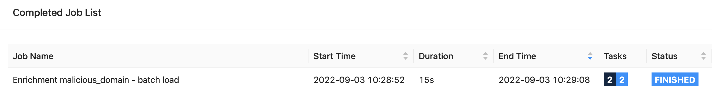
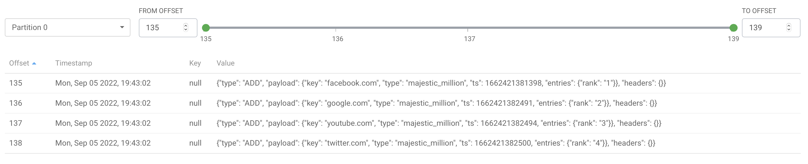
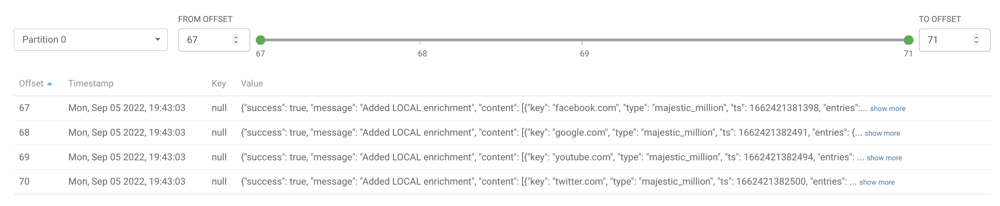

# Batch Enrichment Loading

The Batch enrichment loader reads CSV files, converts the rows to enrichment keys and values and 
writes the enrichments to either HBase or a topic.  

The HBase tables and column families storing enrichments must exist prior to loading.  The user loading the enrichments must have write access to the tables. 

## Properties Configuration

| Property Name | Type                                    | Description                                  | Required/Default |Example             |
|---------------| ----------------------------------------| -------------------------------------------- | ------------------- | -----------------|
| enrichment.source.file | File Path | Path to CSV file defining enrichments.  When running in Yarn, specify an HDFS or s3 file path accessible to yarn resource managers. | Required | hdfs:/user/cybersec/enrichments/malicious_domains.csv
| enrichment.topic.input| Topic name (String) | Set local enrichments by publishing enrichment commands to a topic.  The topic name should match the enrichment input topic consumed by a triaging job. | Optional.  If omitted, job writes to HBase | my.enrichments.input |
| enrichment.source.skipfirstline | Boolean | If true, do not create an enrichment from the text on the first line in enrichment.source.file.  If false, read all lines of the source file.   | Default false | true|
| enrichment.source.columns | Comma separated String | Names of columns in the CSV file.   Column names should match enrichment key and value field names. To omit a column, use an empty string for the field name. | Required | domain,,source |
| enrichment.type | String | The name of the enrichment type to load | Required | malicious_domain |
| enrichment.config.file | File Path | Path to the  [EnrichmentsConfigFile](../flink-enrichment-lookup-hbase/enrichment_json.md) mapping from messages to enrichment key and values.   Defines storage format for enrichment.   | Optional | enrichments_storage.json |
| enrichment.source.keyfieldname | String | Name of the column to be used as the enrichment key. | Required if enrichment.config.file is not set.  | domain |
| enrichments.table | String | (Deprecated) Name of table storing enrichments in simple format.  Use enrichment.config.file instead. | Required when enrichment.config file is not set. | enrichments |

### Examples

#### Create the enrichments_storage.json file mapping enrichment types to hbase tables.
The example below specifies a malicious_domain enrichment in simple format and a majestic_million enrichment in Metron format.
```
$ cat enrichments_storage.json 
{
  "storageConfigs": {
    "default": {
      "format": "HBASE_METRON",
      "hbaseTableName": "metron_enrich_example",
      "columnFamily": "cf"
    },
    "simple": {
      "format": "HBASE_SIMPLE",
      "hbaseTableName": "simple_enrich_example"
    }
  },
  "enrichmentConfigs": {
    "malicious_domain": {
      "storage": "simple",
      "fieldMapping": {
        "keyFields": [
          "domain"
        ],
        "valueFields": [
          "source"
        ],
        "streamingSources": [
          "malicious_domain"
        ]
      }
    },
    "majestic_million": {
      "storage": "default",
      "fieldMapping": {
        "keyFields": [
          "domain"
        ],
        "valueFields": [
          "rank"
        ],
        "streamingSources": [
          "majestic_million"
        ]
      }
    }
  }
}
```

#### Simple enrichment - Load the file malicious_domain_samples.csv and write to malicious_domain enrichment in simple format

* Create enrichment Hbase table using hbase shell. 
For simple enrichments, create the hbase table with an 'id' column family and a column family with the same name as the enrichment type.   The 'id' column family is a fixed column family and only needs to be created once:
```
create 'table_name', 'id', 'enrichment_type'
```

If the table exists already and contains the 'id' column use the alter command:
```
alter 'table_name', 'enrichment_type'
```

For this example, create the simple_enrich_example table with id and malicious_domain column families. 
```
$ hbase shell
hbase:001:0> create 'simple_enrich_example', 'id', 'malicious_domain'
Created table simple_enrich_example
Took 6.2447 seconds                                                                                                                                                                                              
=> Hbase::Table - simple_enrich_example
```

* Create a CSV file that maps the enrichment keys to enrichment values.  The first column is the name of the domain and the second column is the source reporting the malicious domain.
```
$ cat malicious_domain_samples.csv 
039b1ee.netsolhost.com,abuse.ch
0x.x.gg,abuse.ch```
load_malicious_domain.properties
```

* Create a .properties file for the flink enrichment loading job. 
enrichment.source.skipfirstline is set to false because the .csv file does not contain a header.
enrichment.source.columns specifies the column in the file.  The columns must match the keyFields and valueFields specified in the enrichment_storage.json file.
```
$ cat malicious_domain_simple.properties 
enrichment.source.file=malicious_domain_samples.csv
enrichment.source.skipfirstline=false
enrichment.type=malicious_domain
enrichment.source.columns=domain,source

enrichment.config.file=enrichments_storage.json
parallelism=1
```

* Create a script to run the flink enrichment loading job.
```
$ cat load_malicious_simple.sh 
flink run \
-yt malicious_domain_samples.csv \
--jobmanager yarn-cluster -yjm 2048 -ytm 2048 --detached --yarnname "Simple - Malicous Domain Enrichment Import" \
flink-enrichment-loading-0.0.1-SNAPSHOT.jar  malicious_domain_simple.properties
```

* Change to the directory containing malicious_domain_samples.csv file.   Run the load_malicious_simple.sh script.
```
$ ./load_malicious_simple.sh
... truncated output... look for the message below indicating the job started.
2022-09-03 07:28:53,401 INFO  org.apache.flink.yarn.YarnClusterDescriptor                  [] - The Flink YARN session cluster has been started in detached mode. In order to stop Flink gracefully, use the following command:
```
* Open the Flink dashboard and scroll down to Completed Job.    Verify that the enrichment import command has status Finished.
If you don't see the job, check the running jobs.  Verify that the job is running and not failing or restarting.   If you don't see the job running, click on the End Time column header until the list is sorted descending by time.

* Troubleshooting : If the job is restarting, go to the Flink dashboard and examine the logs for the "Enrichment malicious_domain - batch load" job.  
Common reasons for failure are that the enrichment.csv file can't be read.  Verify that the enrichment.source.file exists.  If using a shippped file on the flink run command, verify that the shipped file name matches the file specified in .properties.  
If using an HDFS file, verify that the file exists and can be read by the flink job user.
* View the enrichment entries in the 'simple_enrich_example' hbase table.  Each enrichment value has two entries.  One in the id column family and one in the malicious_domain column family.
```
hbase:001:0> scan 'simple_enrich_example'
ROW                                                   COLUMN+CELL                                                                                                                                                
 039b1ee.netsolhost.com                               column=id:key, timestamp=1662217376644, value=039b1ee.netsolhost.com                                                                                       
 039b1ee.netsolhost.com                               column=malicious_domain:source, timestamp=1662217376644, value=abuse.ch                                                                                    
 0x.x.gg                                              column=id:key, timestamp=1662217376662, value=0x.x.gg                                                                                                      
 0x.x.gg                                              column=malicious_domain:source, timestamp=1662217376662, value=abuse.ch                                                                                    
2 row(s)
```
* To use the simple enrichment, add the following to the enrichment lookup config in the triage flink job.  
The example below applies the malious_domain enrichment to a squid event.   The hbase lookup task gets the value of the domain event field.  
If the domain field is set, the hbase task looks up the value of the domain field in the simple_enrich_example malicious_domain column family and then adds the enrichment values to the event.

```
{
  {
    "source": "squid",
    "kind": "HBASE",
    "fields": [
      {
        "name": "domain",
        "enrichmentType": "malicious_domain"
      }
    ]
  }
}
```
#### Metron enrichment - Load the file majestic_million_samples.csv and write to majestic_million enrichment in Metron format
* Create the table and column family specified in the enrichment.config.file:
The enrichment table and column family should match the enrichments_storage.json file. 

create 'enrichment_table_name', 'enrichment_column_family'
```
$ hbase shell
hbase:001:0> create 'metron_enrich_example', 'cf'
Created table metron_enrich_example
Took 4.0663 seconds                                                                                                                                                                                              
=> Hbase::Table - metron_enrich_example
```
* Create a CSV file that maps the enrichment keys to enrichment values.  The first column is the name of the domain and the second column is the source reporting the malicious domain.
```
$ cat majestic_million_samples.csv 
GlobalRank,TldRank,Domain,TLD,RefSubNets,RefIPs,IDN_Domain,IDN_TLD,PrevGlobalRank,PrevTldRank,PrevRefSubNets,PrevRefIPs
1,1,facebook.com,com,494155,2890130,facebook.com,com,1,1,493314,2868293
2,2,google.com,com,493487,2701099,google.com,com,2,2,492052,2673220
3,3,youtube.com,com,449217,2382052,youtube.com,com,3,3,448072,2359580
4,4,twitter.com,com,437566,2314363,twitter.com,com,4,4,436584,2294348
```
* Create a .properties file for the flink enrichment loading job. 
enrichment.source.skipfirstline is set to true because the .csv has a header line that should not be used to write an enrichment to the hbase table.
enrichment.source.columns specifies the columns in the file.  The columns must match the keyFields and valueFields specified in the enrichment_storage.json file.  If a column will not be used to write to the enrichment, use an empty column name.
```
$ cat majestic_metron.properties
enrichment.source.file=majestic_million_samples.csv
enrichment.source.skipfirstline=true
enrichment.type=majestic_million
enrichment.source.columns=rank,,domain,,,,,,,,,

enrichment.config.file=enrichments_storage.json
parallelism=1
```

* Create a script to run the flink enrichment loading job.  The samples csv file is shipped to the flink job using the -yt option.
```
$ cat load_majestic_metron.sh 
flink run \
-yt majestic_million_samples.csv \
--jobmanager yarn-cluster -yjm 2048 -ytm 2048 --detached --yarnname "Metron - Majestic Million Enrichment Import" \
flink-enrichment-loading-0.0.1-SNAPSHOT.jar  majestic_metron.properties
```
* Change to the directory containing majestic_million_samples.csv file.   Run the load_majestic_metron.sh script.
```
$ ./load_majestic_metron.sh 
... output truncated ... 
2022-09-03 08:46:24,883 INFO  org.apache.flink.yarn.YarnClusterDescriptor                  [] - The Flink YARN session cluster has been started in detached mode. In order to stop Flink gracefully, use the following command:
```
* Open the Flink dashboard and verify that the "Enrichment majestic_million - batch load" flink job completed with Finished status.  
* Use the hbase shell to view the majestic_million enrichment.   The keys are constructed with hash values to improve HBase lookup performance.
```
$ hbase shell
hbase:001:0> scan 'metron_enrich_example'
ROW                                                   COLUMN+CELL                                                                                                                                                
 2\xE0\xF5\xE4\xAE\xDB\x9E\x1A<\x8D\xCA\xA1\xC3V\xD4\ column=cf:v, timestamp=1662219999941, value={"rank":"1"}                                                                                                   
 x9B\x00\x10majestic_million\x00\x0Cfacebook.com                                                                                                                                                                 
 7P\x0B\x82q\x08w\xF2n\x18DwPS\x89m\x00\x10majestic_m column=cf:v, timestamp=1662219999962, value={"rank":"4"}                                                                                                   
 illion\x00\x0Btwitter.com                                                                                                                                                                                       
 \xCF\xE8\xCD\x89c\x0B\xF2(\x1E\x1C\xCB\xF2\xC0\xCD\x column=cf:v, timestamp=1662219999959, value={"rank":"3"}                                                                                                   
 A9\xCB\x00\x10majestic_million\x00\x0Byoutube.com                                                                                                                                                               
 \xF7\xC5$[\xDA,\x03cGg\xC6}\x039\xAB\x8E\x00\x10maje column=cf:v, timestamp=1662219999954, value={"rank":"2"}                                                                                                   
 stic_million\x00\x0Agoogle.com                                                                                                                                                                                  
4 row(s)
Took 1.9962 seconds
```
* To use a Metron enrichment, add a stellar enrichment and use stellar code to add the enrichment to the event.

#### Local enrichment - Load the file majestic_million_samples.csv and write to majestic_million enrichment to the triaging job enrichment topic.

* Open the properties file for the triaging flink job.   Find the enrichment.topic.input property:

```
enrichment.topic.input=my-pipeline.enrichments.input
```

* Create a CSV file that maps the enrichment keys to enrichment values.  The first column is the name of the domain and the second column is the source reporting the malicious domain.
```
$ cat majestic_million_samples.csv 
GlobalRank,TldRank,Domain,TLD,RefSubNets,RefIPs,IDN_Domain,IDN_TLD,PrevGlobalRank,PrevTldRank,PrevRefSubNets,PrevRefIPs
1,1,facebook.com,com,494155,2890130,facebook.com,com,1,1,493314,2868293
2,2,google.com,com,493487,2701099,google.com,com,2,2,492052,2673220
3,3,youtube.com,com,449217,2382052,youtube.com,com,3,3,448072,2359580
4,4,twitter.com,com,437566,2314363,twitter.com,com,4,4,436584,2294348
```
* Create a .properties file for the enrichment loading job.

The properties file is the same as the previous example with the addition of the enrichment.topic.input setting and kafka producer properties.
```
$ cat majestic_topic.properties 

enrichment.source.file=majestic_million_samples.csv
enrichment.source.skipfirstline=true
enrichment.source.columns=rank,,domain,,,,,,,,,
enrichment.type=majestic_million

enrichment.config.file=enrichments_storage.json
parallelism=1

# write enrichments to Kafka
enrichment.topic.input=my-pipeline.enrichments.input

kafka.bootstrap.servers=cybersec-1.vpc.cloudera.com:9092,cybersec-2.vpc.cloudera.com:9092
schema.registry.url=http://cybersec-1.vpc.cloudera.com:7788/api/v1
```

* Create a script to run the flink-enrichment-loading job:

```
$ cat load_majestic_topic.sh 
flink run \
-yt majestic_million_samples.csv \
--jobmanager yarn-cluster -yjm 2048 -ytm 2048 --detached --yarnname "Topic - Majestic Million Enrichment Import" \
flink-enrichment-loading-0.0.1-SNAPSHOT.jar  majestic_topic.properties
```

* Change to the directory containing majestic_million_samples.csv file.   Run the load_majestic_topic.sh script.
* Open the Flink dashboard and verify that the "Enrichment majestic_million - batch load" flink job completed with Finished status.  
* View the EnrichmentCommand records in the topic specified in the enrichment.topic.input property.   Select Avro from the Value Deserialization setting.

* If a triaging flink job is consuming the enrichment.topic.input topic, open the response topic in SMM and view the EnrichmentCommandResponse records.

